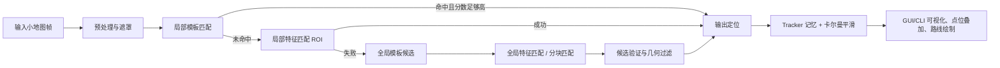

# roco-map-tracker

`roco-map-tracker` 是一个面向《洛克王国世界》小地图截图/屏幕区域的 2D 定位原型。

它的目标是做一套在真实游戏画面里更稳、更方便调试的工程化识图链路：

- 默认自动准备并使用项目内置的世界地图与采集点资源
- 支持单张截图定位和屏幕区域持续识别
- 在 macOS 上提供中文 GUI，便于直接观察定位、点位和路线结果
- 支持在完整大地图上叠加当前位置、采集点、素材筛选和资源路线

## 当前实现概览

当前默认方案以 `biliwiki` 的世界地图/采集数据体系为主，定位与展示逻辑已经围绕这套资源打通：

- 默认配置：`configs/rocom_tracker.yaml`
- 默认地图：`data/rocom_biliwiki/rocom_base_z8.png`
- 默认点位：`data/rocom_biliwiki/rocom_caiji_points.json`
- 默认分类：`data/rocom_biliwiki/rocom_caiji_categories.json`
- 默认图标缓存：`data/rocom_biliwiki/icon_cache_wiki/`

注意：`data/rocom_biliwiki/` 可以在首次运行时自动生成/补齐。如果本地缺少底图或点位缓存，程序会按当前代码中的配置地址自动下载或回退到镜像资源。

## 整体思路

项目采用的是“局部跟踪优先，失联后全局重定位”的混合策略：



简化理解就是：

1. 先把小地图里不稳定的 UI 区域尽量遮掉，只保留有助于识别的内容。
2. 如果上一帧位置可信，优先在附近小范围快速搜索，降低计算量。
3. 如果跟丢了，再扩大到整张世界地图做重定位。
4. 得到候选位置后，不只看特征点数量，还会做灰度/边缘/颜色一致性验证。
5. 最终结果再进入跟踪器与卡尔曼滤波器，让连续帧更稳定。

## 当前识图算法

### 1. 小地图预处理

对应实现：`src/preprocess.py`

当前默认使用 `minimap_circle` 模式，核心步骤包括：

- 用 `HoughCircles` 估计主圆形小地图范围
- 构建圆形 `content_mask`，去掉外圈 UI
- 遮掉中心角色箭头/朝向指示器
- 遮掉中心附近或边缘上饱和度高、疑似按钮/图标/文字的区域
- 额外遮掉已知会干扰匹配的角色头像/图标区域
- 从内容掩码进一步腐蚀得到 `feature_mask`，降低边缘脏信息对特征点的影响

这里实际上维护了两种 mask：

- `content_mask`：用于模板匹配和候选验证
- `feature_mask`：用于特征点检测/描述子提取

### 2. 特征匹配主线

对应实现：`src/feature_matcher.py`、`src/global_localizer.py`

当前支持三种特征：

- `orb`（默认）
- `akaze`
- `sift`

默认匹配流程：

- 对地图和小地图提取局部特征点与描述子
- 使用 `BFMatcher.knnMatch(..., k=2)` 做双近邻匹配
- 用 `ratio test` 过滤歧义匹配
- 对保留下来的匹配点用 `findHomography(..., RANSAC)` 估计变换
- 如果单应性失败，则回退到 `estimateAffinePartial2D(..., RANSAC)`

最后再把变换结果投影到大地图上，得到：

- 中心点 `(x, y)`
- 旋转角 `theta`
- 投影四边形 `corners`
- 外接框 `bbox`
- 匹配数与内点数

### 3. 多尺度模板匹配辅助线

对应实现：`src/global_localizer.py`

为了应对纯特征匹配在某些区域不稳定、或局部纹理重复的问题，当前实现还并行维护了一条模板匹配辅助线：

- 对小地图灰度图按多组缩放比例生成模板
- 使用 `content_mask` 作为模板匹配 mask
- 采用 `cv2.matchTemplate(..., TM_CCORR_NORMED)` 搜索候选位置
- 全局搜索时先在降采样地图上粗搜，再回到原图附近做精搜
- 局部搜索时直接在 tracker 给出的 ROI 中搜索

模板匹配不是直接拿来当最终答案，而是和特征匹配结果一起竞争最佳候选。

### 4. 全局重定位 + 分块匹配

对应实现：`src/global_localizer.py`

在完全失联时，项目会把整张大地图切成滑窗 tile，提前缓存每块的特征：

- `global_tile_size`
- `global_tile_stride`
- `global_tile_top_k`

运行时会先按匹配数筛出最有希望的若干 tile，再对这些 tile 做更精细的几何估计。这样可以避免每次全图重定位都把整张大图直接硬算一遍。

此外，全局搜索本身也会尝试多组 `frame_scales`，适配不同缩放或截图尺寸差异。

### 5. 候选验证与几何约束

对应实现：`src/global_localizer.py`

当前实现不是“谁匹配点多就直接信谁”，而是增加了候选验证环节：

- 将地图候选区域反投影回小地图坐标系
- 计算灰度强度相似度
- 计算边缘重合度
- 如果有彩色帧，再叠加 HSV 颜色相似度
- 按配置权重把特征分数与验证分数融合成最终得分

同时还会过滤明显不合理的几何结果，例如：

- 四边形不凸
- 投影面积过小
- 宽高比过于离谱
- 上下边/左右边差异太夸张
- 旋转角超过允许范围

### 6. 局部跟踪、光流预测与卡尔曼平滑

对应实现：`src/tracker.py`、`src/kalman_filter.py`、`src/pipeline.py`

持续识别时，项目会优先复用上一帧结果：

- 根据上一帧位置生成局部搜索 ROI
- 使用 `calcOpticalFlowPyrLK` 估计两帧之间的小地图位移
- 用位移预测下一帧在大地图上的中心点
- 对新结果做运动门限检查，过滤突然跳变
- 对输出位置做卡尔曼平滑，减小抖动

如果当前帧彻底识别失败：

- 先进入 `relocalizing` 状态
- 多帧失败后进入 `lost` 状态
- `lost` 期间会用卡尔曼预测值或上一帧结果做兜底显示

## 当前已实现功能

### 定位能力

- 单张截图定位
- 屏幕区域持续识别
- 局部跟踪优先、失联后全局重定位
- 多尺度模板匹配 + 特征匹配融合
- 定位结果包含位置、角度、置信分、状态、匹配统计

### GUI 与交互

对应实现：`src/gui.py`、`src/map_pyramid.py`

- 中文 GUI，适合 macOS 直接使用
- 支持选择单张截图或屏幕区域
- 支持滚轮缩放、拖拽查看、回到当前位置
- 大地图支持 viewport 渲染，而不是每次整图重绘
- 使用地图金字塔缓存优化大图缩放/平移体验
- 持续识别时通过异步“只保留最新帧”的管线降低积压

### 采集点与筛选

对应实现：`src/poi_overlay.py`、`src/resource_sources.py`

- 自动准备 biliwiki 采集点资源
- 当前内置 34 种可用采集素材分类
- 支持矿物/植物快速筛选
- 支持按分类、关键词、标签数量控制叠加显示
- 支持图标缓存和点位名称显示
- 支持手动刷新 biliwiki 点位缓存

### 资源路线生成

对应实现：`src/resource_routes.py`

当前路线生成是“采集路线草图”，不是游戏寻路导航。它更偏向帮助你观察素材分布与局部串点顺序：

- 先按已选素材分类收集点位，并按 `category_id + 像素坐标 + 标题` 去重
- 基于点集的最小生成树边长中位数，估算“局部可接受距离”
- 仅保留短边连通关系，用并查集把点拆成多个局部簇
- 按起点位置或簇重心顺序访问各簇，尽量优先处理近处、高密度区域
- 在每个簇内先做近邻排序，再对较短路线执行简化 2-opt 优化
- 如果排序结果里仍存在明显长跳点，再按 gap 阈值二次切成多段 segment
- 绘制时每段使用不同颜色，并标出起点/终点
- 将路线结果缓存到 `outputs/route_cache/`

所以现在的路线展示更强调：

- 优先连接短距离且密集的素材点
- 避免一条线跨越半张地图去串远点
- 允许显示多段、分片的采集路线
- 更适合做“采集分布观察”和“局部刷点顺序参考”，而不是严格意义上的自动寻路

## 数据与参考源

### 当前代码中的默认数据源

对应实现：`src/resource_sources.py`

1. biliwiki 世界地图页面  
   [wiki.biligame.com/rocom/大地图](https://wiki.biligame.com/rocom/%E5%A4%A7%E5%9C%B0%E5%9B%BE)

2. biliwiki 采集点数据页  
   [wiki.biligame.com/rocom/Data:Mapnew/point.json](https://wiki.biligame.com/rocom/Data:Mapnew/point.json)

3. 底图回退镜像  
   [raw.githubusercontent.com/zkjisj/luoke_location/main/out/rocom_base_z8.png](https://raw.githubusercontent.com/zkjisj/luoke_location/main/out/rocom_base_z8.png)

4. 点位回退镜像  
   [raw.githubusercontent.com/zkjisj/luoke_location/main/out/rocom_caiji_points.json](https://raw.githubusercontent.com/zkjisj/luoke_location/main/out/rocom_caiji_points.json)

这些地址是当前仓库代码里配置的来源；首次运行缺资源时会按这套配置自动补齐本地文件。

### 外部项目参考

下面两个仓库也被纳入当前 README 的参考源说明，便于后续对照思路、资源组织方式和定位实现：

- [Game-Map-Tracker](https://github.com/761696148/Game-Map-Tracker)
- [luoke_location](https://github.com/zkjisj/luoke_location)

其中 `luoke_location` 还直接出现在当前代码的回退资源地址配置中。

### 仓库内保留的历史/实验数据

- `data/rocom_17173/`：早期互动地图实验数据与元信息快照

这部分数据目前不是默认 GUI/CLI 主流程依赖，但仍可作为调试、对照或后续扩展的参考素材。

### 识图实现所依赖的核心 OpenCV 能力

当前实现主要基于 OpenCV 提供的成熟算子组合，并做了工程化串联：

- `ORB / AKAZE / SIFT`
- `BFMatcher + ratio test`
- `findHomography / estimateAffinePartial2D + RANSAC`
- `matchTemplate(TM_CCORR_NORMED, mask=...)`
- `calcOpticalFlowPyrLK`
- `HoughCircles`
- `GaussianBlur / Canny / morphology / connectedComponents`

## 安装环境

推荐在 macOS 下使用项目虚拟环境：

```bash
python3 -m venv .venv
./.venv/bin/pip install -r requirements.txt
```

依赖说明：

- GUI 依赖 `Tkinter`
- 持续屏幕采集依赖 `mss`
- 图像处理依赖 `opencv-python`
- 配置解析依赖 `PyYAML`

macOS 下如需屏幕区域识别，请给当前 Python 或 Codex 授予“屏幕录制”权限。

## 启动方式

### GUI

```bash
./launch_gui.command
```

或：

```bash
./.venv/bin/python main.py --gui
```

### 命令行单图定位

```bash
./.venv/bin/python main.py \
  --frame /absolute/path/to/minimap.png \
  --save-visualizations
```

### 命令行持续识别

```bash
./.venv/bin/python main.py \
  --screen-region 1800,260,220,220 \
  --capture-interval-ms 250 \
  --visualize
```

### 常见附加参数

```bash
./.venv/bin/python main.py \
  --frame /absolute/path/to/minimap.png \
  --show-poi-overlay \
  --show-poi-labels \
  --poi-category-ids 701,702,705
```

## 输出结果

CLI 每处理一帧都会输出一条 JSON，包含：

- `x`, `y`：大地图像素坐标
- `theta`：估计旋转角
- `score`：当前综合得分
- `state`：`tracking / relocalizing / lost`
- `method`：本次命中的主要路径，如 `local_template_match`、`global_tile_match` 等

如开启可视化，还会把定位框、当前位置以及可选的采集点叠加到输出图中。

## 主要目录说明

- `main.py`：根入口，转发到 `src.main`
- `configs/rocom_tracker.yaml`：当前默认配置
- `src/main.py`：CLI 入口
- `src/gui.py`：中文 GUI
- `src/map_pyramid.py`：大地图金字塔与 viewport 渲染
- `src/preprocess.py`：小地图预处理与遮罩构建
- `src/feature_matcher.py`：特征提取与匹配
- `src/global_localizer.py`：全局/局部定位与候选验证
- `src/tracker.py`：局部跟踪、光流预测、运动门限
- `src/kalman_filter.py`：位置平滑
- `src/pipeline.py`：定位主流程编排
- `src/async_frame_pipeline.py`：持续识别时的异步最新帧管线
- `src/poi_overlay.py`：采集点、图标与标签叠加
- `src/resource_routes.py`：路线生成与缓存
- `src/resource_sources.py`：biliwiki 资源准备、刷新和默认配置注入
- `tests/`：回归测试

## 基础验证

建议在修改定位逻辑后执行：

```bash
python3 -m py_compile src/*.py tests/*.py main.py
python3 -m unittest discover -s tests -v
```

单图快速验证示例：

```bash
./.venv/bin/python main.py \
  --frame /absolute/path/to/minimap.png \
  --save-visualizations
```

## 已知特点与局限

- 这是基于固定地图资源的 2D 对位系统，不是三维导航系统。
- 结果强依赖当前世界地图风格与小地图 UI 样式；如果游戏 UI 大改，需要同步调整预处理规则。
- 复杂遮挡、剧烈缩放变化、极低纹理区域仍可能导致失联。
- 当前资源路线是“点位串联建议”，不是考虑地形阻挡、传送、可行走网格的真实寻路。
- 大地图与特征索引会占用较多内存，调试时不要并行启动多套完整管线。
